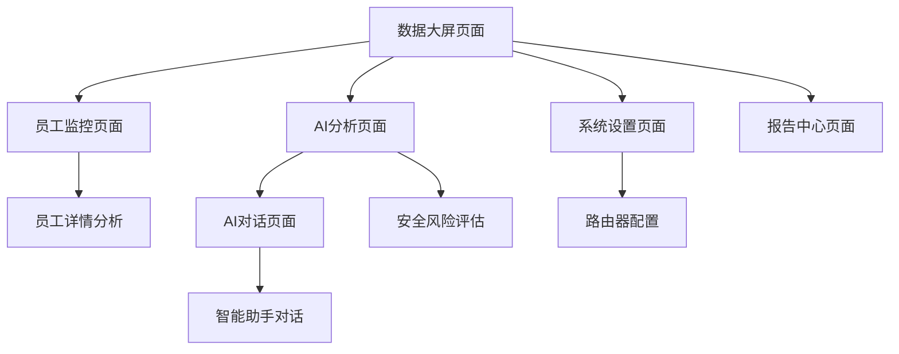

# 企业网络监控数据大屏系统 - 产品需求文档

## 1. 产品概述

企业网络监控数据大屏系统是一个集成AI分析能力的企业级网络流量监控平台，通过路由器收集局域网资源，实时监控员工上网行为，并提供智能分析和安全风险评估。

- 系统解决企业网络安全管理难题，帮助管理者了解员工网络使用情况，识别潜在安全风险，提升企业网络安全防护能力。
- 目标为中大型企业提供本地化部署的AI驱动网络监控解决方案，保障数据安全的同时提供智能化分析服务。

## 2. 核心功能

### 2.1 用户角色

| 角色 | 注册方式 | 核心权限 |
|------|----------|----------|
| 系统管理员 | 系统初始化创建 | 系统配置、用户管理、全部数据查看、AI模型配置 |
| 网络管理员 | 管理员邀请注册 | 网络监控、流量分析、安全报告查看、AI分析使用 |
| 部门主管 | 管理员分配权限 | 查看本部门员工数据、基础分析报告 |

### 2.2 功能模块

我们的企业网络监控系统包含以下主要页面：

1. **数据大屏页面**：实时流量监控、网络状态总览、关键指标展示
2. **员工监控页面**：员工列表管理、个人上网行为分析、流量统计图表
3. **AI分析页面**：智能行为分析、安全风险评估、知识库匹配分析
4. **AI对话页面**：智能助手对话、数据分析总结、修复建议生成
5. **系统设置页面**：路由器配置、监控规则设置、AI模型管理
6. **报告中心页面**：历史报告查看、数据导出、趋势分析

### 2.3 页面详情

| 页面名称 | 模块名称 | 功能描述 |
|----------|----------|----------|
| 数据大屏页面 | 实时监控面板 | 显示网络总流量、在线用户数、异常流量告警等关键指标的实时数据 |
| 数据大屏页面 | 流量趋势图表 | 展示24小时、7天、30天的网络流量变化趋势，支持多维度数据切换 |
| 数据大屏页面 | 热门网站排行 | 统计员工访问频率最高的网站，识别工作相关和非工作相关网站 |
| 员工监控页面 | 员工列表 | 显示所有员工基本信息、在线状态、今日流量使用情况 |
| 员工监控页面 | 个人详情分析 | 查看单个员工的详细上网记录、访问网站分类、时间分布图表 |
| 员工监控页面 | 流量统计图表 | 使用ECharts展示员工流量使用的柱状图、饼图、折线图等多种图表 |
| AI分析页面 | 行为模式识别 | AI分析员工上网行为模式，识别异常访问、工作效率评估 |
| AI分析页面 | 安全风险评估 | 基于行业知识库分析潜在安全威胁，生成风险等级和详细报告 |
| AI分析页面 | 知识库匹配 | 载入不同行业知识库，匹配员工访问内容与行业规范的符合度 |
| AI对话页面 | 智能助手 | 使用TDesign Chat组件实现与AI助手的自然语言对话 |
| AI对话页面 | 数据分析总结 | AI自动生成员工数据的分析总结，包括工作效率、安全风险等 |
| AI对话页面 | 修复建议生成 | 针对发现的问题提供具体的修复建议和操作指导 |
| 系统设置页面 | 路由器配置 | 配置路由器连接参数、数据采集规则、监控范围设置 |
| 系统设置页面 | AI模型管理 | 管理本地部署的AI模型、知识库更新、模型参数调优 |
| 报告中心页面 | 报告生成 | 自动生成日报、周报、月报，支持自定义报告模板 |

## 3. 核心流程

**管理员操作流程：**
管理员登录系统 → 配置路由器连接 → 设置监控规则 → 查看数据大屏 → 分析员工数据 → 使用AI分析功能 → 生成管理报告

**AI分析流程：**
数据采集 → 行为模式识别 → 知识库匹配 → 风险评估 → 生成分析报告 → AI对话交互 → 提供修复建议

## 4. 用户界面设计

### 4.1 设计风格

- **主色调**：深蓝色 (#1890FF) 和科技蓝 (#0052CC)，体现专业和科技感
- **辅助色**：警告橙 (#FF7D00)、成功绿 (#00A870)、危险红 (#E34D59)
- **按钮样式**：圆角按钮，支持悬停效果和点击反馈
- **字体**：系统默认字体，标题使用16-20px，正文使用14px，数据展示使用12px
- **布局风格**：卡片式布局，顶部导航栏，左侧菜单栏，响应式网格系统
- **图标风格**：使用TDesign图标库，线性图标风格，保持一致性

### 4.2 页面设计概览

| 页面名称 | 模块名称 | UI元素 |
|----------|----------|---------|
| 数据大屏页面 | 实时监控面板 | 深色背景，大字号数据展示，使用渐变色卡片，动态数字滚动效果 |
| 数据大屏页面 | 流量趋势图表 | ECharts图表，蓝色主题，平滑曲线，支持缩放和数据点提示 |
| 员工监控页面 | 员工列表 | TDesign Table组件，斑马纹表格，支持排序和筛选，状态标签使用不同颜色 |
| 员工监控页面 | 流量统计图表 | 多种ECharts图表类型，统一配色方案，支持图表切换动画 |
| AI分析页面 | 行为模式识别 | 卡片式布局，进度条显示分析进度，结果使用标签和评分展示 |
| AI分析页面 | 安全风险评估 | 风险等级使用颜色编码，详细信息使用折叠面板，支持一键修复按钮 |
| AI对话页面 | 智能助手 | TDesign Chat组件，消息气泡样式，支持代码高亮和图表嵌入 |
| 系统设置页面 | 配置表单 | TDesign Form组件，分组表单布局，实时验证反馈 |

### 4.3 响应式设计

系统采用桌面优先的响应式设计，主要面向PC端使用，同时兼容平板设备。数据大屏页面针对大屏显示器进行优化，支持全屏展示模式。移动端提供基础的数据查看功能，但不支持复杂的配置操作。