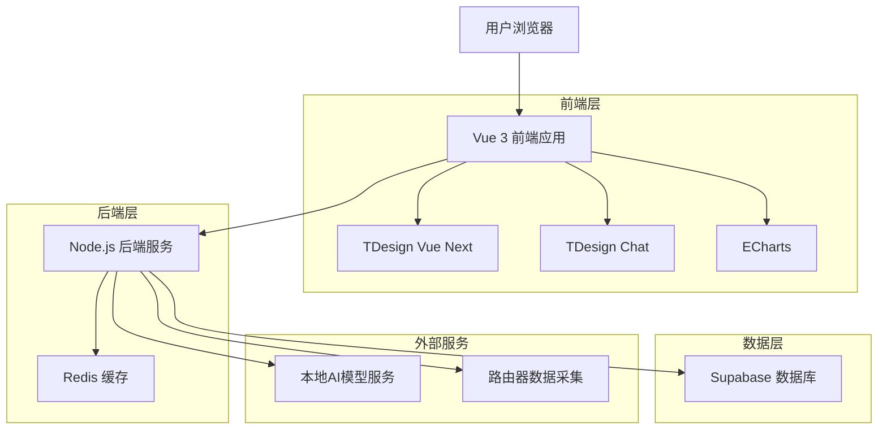
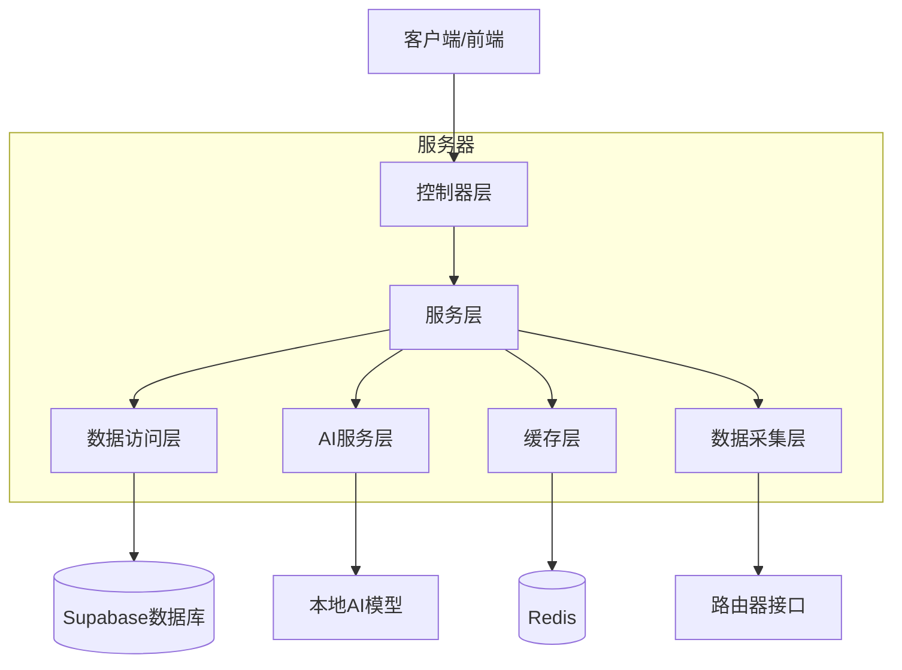
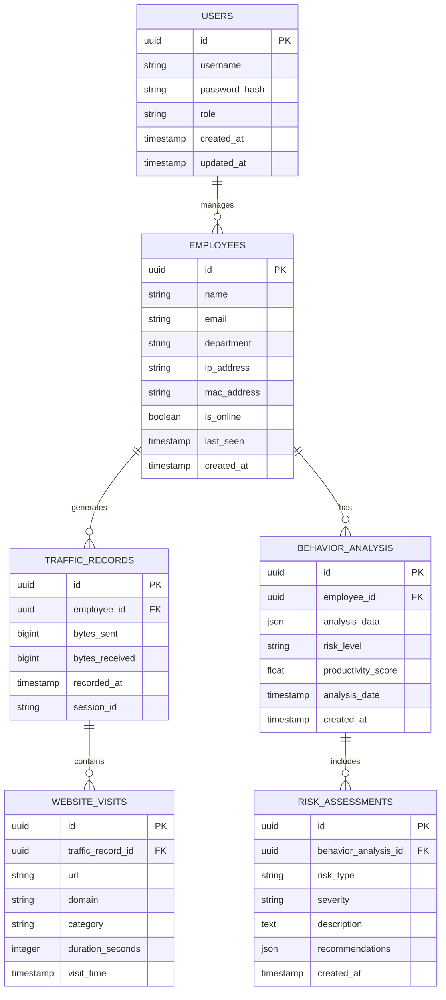

# 企业网络监控数据大屏系统 - 技术架构文档

## 1. 架构设计



## 2. 技术描述

* 前端：Vue 3 + TDesign Vue Next + TDesign Chat + ECharts + Vite

* 后端：Node.js + Express + Socket.io

* 数据库：Supabase (PostgreSQL)

* 缓存：Redis

* AI服务：本地部署AI模型 (支持多种开源LLM)

## 3. 路由定义

| 路由           | 用途                     |
| ------------ | ---------------------- |
| /            | 重定向到数据大屏页面             |
| /dashboard   | 数据大屏页面，显示实时网络监控数据和关键指标 |
| /employees   | 员工监控页面，显示员工列表和个人上网行为分析 |
| /ai-analysis | AI分析页面，提供智能行为分析和安全风险评估 |
| /ai-chat     | AI对话页面，智能助手对话和数据分析总结   |
| /settings    | 系统设置页面，路由器配置和AI模型管理    |
| /reports     | 报告中心页面，历史报告查看和数据导出     |
| /login       | 登录页面，用户身份验证            |

## 4. API定义

### 4.1 核心API

**用户认证相关**

```
POST /api/auth/login
```

请求参数:

| 参数名      | 参数类型   | 是否必需 | 描述  |
| -------- | ------ | ---- | --- |
| username | string | true | 用户名 |
| password | string | true | 密码  |

响应参数:

| 参数名     | 参数类型    | 描述      |
| ------- | ------- | ------- |
| success | boolean | 登录是否成功  |
| token   | string  | JWT认证令牌 |
| user    | object  | 用户信息    |

**网络监控数据相关**

```
GET /api/network/realtime
```

响应参数:

| 参数名          | 参数类型   | 描述       |
| ------------ | ------ | -------- |
| totalTraffic | number | 总流量 (MB) |
| onlineUsers  | number | 在线用户数    |
| alertCount   | number | 异常告警数量   |
| topWebsites  | array  | 热门网站列表   |

**员工数据相关**

```
GET /api/employees
```

响应参数:

| 参数名        | 参数类型   | 描述   |
| ---------- | ------ | ---- |
| employees  | array  | 员工列表 |
| totalCount | number | 员工总数 |

```
GET /api/employees/:id/traffic
```

响应参数:

| 参数名               | 参数类型   | 描述     |
| ----------------- | ------ | ------ |
| dailyTraffic      | array  | 每日流量数据 |
| websiteCategories | object | 网站分类统计 |
| timeDistribution  | array  | 时间分布数据 |

**AI分析相关**

```
POST /api/ai/analyze-behavior
```

请求参数:

| 参数名          | 参数类型   | 是否必需 | 描述     |
| ------------ | ------ | ---- | ------ |
| employeeId   | string | true | 员工ID   |
| timeRange    | string | true | 分析时间范围 |
| analysisType | string | true | 分析类型   |

响应参数:

| 参数名              | 参数类型   | 描述     |
| ---------------- | ------ | ------ |
| riskLevel        | string | 风险等级   |
| behaviorPatterns | array  | 行为模式分析 |
| recommendations  | array  | 修复建议   |

```
POST /api/ai/chat
```

请求参数:

| 参数名     | 参数类型   | 是否必需  | 描述    |
| ------- | ------ | ----- | ----- |
| message | string | true  | 用户消息  |
| context | object | false | 对话上下文 |

响应参数:

| 参数名         | 参数类型   | 描述     |
| ----------- | ------ | ------ |
| reply       | string | AI回复内容 |
| suggestions | array  | 建议操作   |

## 5. 服务器架构图



## 6. 数据模型

### 6.1 数据模型定义



### 6.2 数据定义语言

**用户表 (users)**

```sql
-- 创建用户表
CREATE TABLE users (
    id UUID PRIMARY KEY DEFAULT gen_random_uuid(),
    username VARCHAR(50) UNIQUE NOT NULL,
    password_hash VARCHAR(255) NOT NULL,
    role VARCHAR(20) DEFAULT 'admin' CHECK (role IN ('admin', 'manager', 'supervisor')),
    created_at TIMESTAMP WITH TIME ZONE DEFAULT NOW(),
    updated_at TIMESTAMP WITH TIME ZONE DEFAULT NOW()
);

-- 创建索引
CREATE INDEX idx_users_username ON users(username);
CREATE INDEX idx_users_role ON users(role);

-- 初始数据
INSERT INTO users (username, password_hash, role) VALUES 
('admin', '$2b$10$example_hash', 'admin'),
('manager1', '$2b$10$example_hash', 'manager');
```

**员工表 (employees)**

```sql
-- 创建员工表
CREATE TABLE employees (
    id UUID PRIMARY KEY DEFAULT gen_random_uuid(),
    name VARCHAR(100) NOT NULL,
    email VARCHAR(255) UNIQUE NOT NULL,
    department VARCHAR(100) NOT NULL,
    ip_address INET,
    mac_address MACADDR,
    is_online BOOLEAN DEFAULT false,
    last_seen TIMESTAMP WITH TIME ZONE,
    created_at TIMESTAMP WITH TIME ZONE DEFAULT NOW()
);

-- 创建索引
CREATE INDEX idx_employees_department ON employees(department);
CREATE INDEX idx_employees_is_online ON employees(is_online);
CREATE INDEX idx_employees_ip_address ON employees(ip_address);

-- 初始数据
INSERT INTO employees (name, email, department, ip_address, mac_address, is_online) VALUES 
('张三', 'zhangsan@company.com', '技术部', '192.168.1.101', '00:1B:44:11:3A:B7', true),
('李四', 'lisi@company.com', '市场部', '192.168.1.102', '00:1B:44:11:3A:B8', true),
('王五', 'wangwu@company.com', '财务部', '192.168.1.103', '00:1B:44:11:3A:B9', false);
```

**流量记录表 (traffic\_records)**

```sql
-- 创建流量记录表
CREATE TABLE traffic_records (
    id UUID PRIMARY KEY DEFAULT gen_random_uuid(),
    employee_id UUID REFERENCES employees(id),
    bytes_sent BIGINT DEFAULT 0,
    bytes_received BIGINT DEFAULT 0,
    recorded_at TIMESTAMP WITH TIME ZONE DEFAULT NOW(),
    session_id VARCHAR(100)
);

-- 创建索引
CREATE INDEX idx_traffic_records_employee_id ON traffic_records(employee_id);
CREATE INDEX idx_traffic_records_recorded_at ON traffic_records(recorded_at DESC);
CREATE INDEX idx_traffic_records_session_id ON traffic_records(session_id);
```

**网站访问记录表 (website\_visits)**

```sql
-- 创建网站访问记录表
CREATE TABLE website_visits (
    id UUID PRIMARY KEY DEFAULT gen_random_uuid(),
    traffic_record_id UUID REFERENCES traffic_records(id),
    url TEXT NOT NULL,
    domain VARCHAR(255) NOT NULL,
    category VARCHAR(50) DEFAULT 'unknown',
    duration_seconds INTEGER DEFAULT 0,
    visit_time TIMESTAMP WITH TIME ZONE DEFAULT NOW()
);

-- 创建索引
CREATE INDEX idx_website_visits_traffic_record_id ON website_visits(traffic_record_id);
CREATE INDEX idx_website_visits_domain ON website_visits(domain);
CREATE INDEX idx_website_visits_category ON website_visits(category);
CREATE INDEX idx_website_visits_visit_time ON website_visits(visit_time DESC);
```

**行为分析表 (behavior\_analysis)**

```sql
-- 创建行为分析表
CREATE TABLE behavior_analysis (
    id UUID PRIMARY KEY DEFAULT gen_random_uuid(),
    employee_id UUID REFERENCES employees(id),
    analysis_data JSONB,
    risk_level VARCHAR(20) DEFAULT 'low' CHECK (risk_level IN ('low', 'medium', 'high', 'critical')),
    productivity_score DECIMAL(3,2) DEFAULT 0.00,
    analysis_date DATE DEFAULT CURRENT_DATE,
    created_at TIMESTAMP WITH TIME ZONE DEFAULT NOW()
);

-- 创建索引
CREATE INDEX idx_behavior_analysis_employee_id ON behavior_analysis(employee_id);
CREATE INDEX idx_behavior_analysis_risk_level ON behavior_analysis(risk_level);
CREATE INDEX idx_behavior_analysis_analysis_date ON behavior_analysis(analysis_date DESC);
```

**风险评估表 (risk\_assessments)**

```sql
-- 创建风险评估表
CREATE TABLE risk_assessments (
    id UUID PRIMARY KEY DEFAULT gen_random_uuid(),
    behavior_analysis_id UUID REFERENCES behavior_analysis(id),
    risk_type VARCHAR(50) NOT NULL,
    severity VARCHAR(20) DEFAULT 'low' CHECK (severity IN ('low', 'medium', 'high', 'critical')),
    description TEXT,
    recommendations JSONB,
    created_at TIMESTAMP WITH TIME ZONE DEFAULT NOW()
);

-- 创建索引
CREATE INDEX idx_risk_assessments_behavior_analysis_id ON risk_assessments(behavior_analysis_id);
CREATE INDEX idx_risk_assessments_risk_type ON risk_assessments(risk_type);
CREATE INDEX idx_risk_assessments_severity ON risk_assessments(severity);

-- 权限设置
GRANT SELECT ON ALL TABLES IN SCHEMA public TO anon;
GRANT ALL PRIVILEGES ON ALL TABLES IN SCHEMA public TO authenticated;
```

